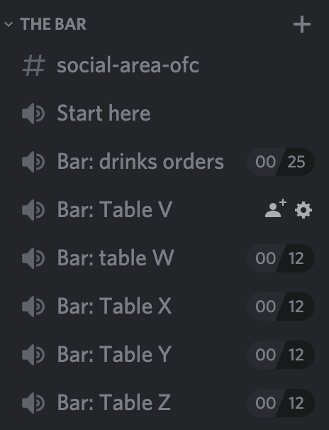

On Discord there are many channels that you can access, but they all fall into
two categories:

* [Text channels](/players-channels-text) are marked with a # symbol.
* Voice channels are marked with a 🔈 symbol.

