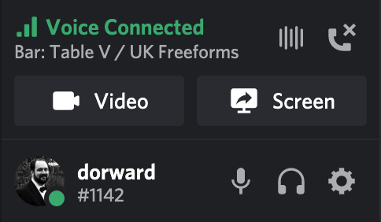
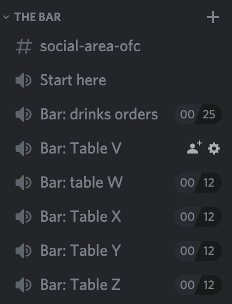

Voice channels allow you to use a microphone and headphones (or speakers) to
talk to other people on a server.

## Joining and leaving

To join a voice channel, click on the channel name.

To leave a voice channel either join a *different* one or click the *hang-up* icon
near the bottom of the list of channels. It looks like a telephone handset with a cross beside it and is on the right hand side.

GMs and committee members can also move you between rooms. Please note if they
move you it will automatically switch any video off and you will need to turn it
back on again.

## Video

Click the button labelled "Video" to send video from your webcam to the channel.

It is also possible to broadcast what is shown on your screen, but this is
unlikely to be needed for a freeform game.

## Limits

If there are a pair of numbers next to a channel name, then there is a limit on
the number of people who can access the channel simultaneously. The first number
is how many people are currently in the channel and the second is the maximum
number.

If there are no explicit limits set then any number of people may join the
channel, but only 25 may broadcast video.

In the image below you can see that the *Bar: Table V* channel accepts up to 12
people but none are currently in it.

