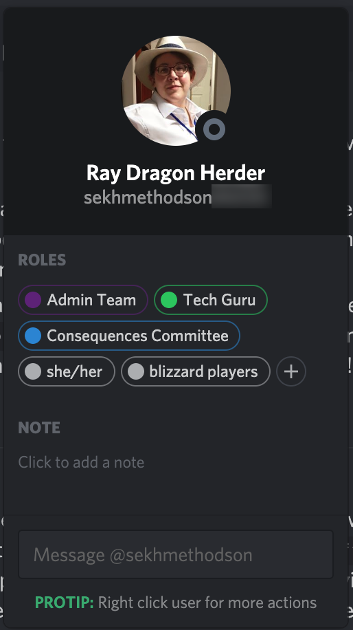

Roles are Discord's way of making users (both people and bots) as members of a
group. These groups have several benefits.

They allow you to find people in a certain group. For example, members of the
admin team have their own section in the sidebar with the list of users and
their names are presented in purple. You can also prefix a message with *@Admin
Team* in order to alert them that you need them to take notice of it.

You can also find out information about a user by examining their roles. If you
click on their name — either in a text chat or in the side bar listing all the
users on the server — it will give you a list of their roles. These will include
their [pronouns](/bots-pronouns) if they choose to present them there.

We also use roles for administration purposes. For example, GMs have permission
to create new voice and text channels for their games.
