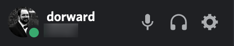

There are a number of Discord features that allow you to express your identity
and the identity of any character you play.

## Your username and avatar

Your username is a text name by which you are known across **all of Discord**,
and your avatar is the image associated with it.

You can change them by going into the user settings (click the cog icon at the bottom
of the list of channels).

Then pick *My Account* from the menu on the left and click the *Edit* button in
the main window.

## Your nickname

This is a name by which you are known on a particular Discord server. You can
change this, for instances, on a UK Freeforms server without affecting the
identity you present on other Discord servers (even if you are logged in to
multiple at the same time).

To change it, click the arrow next to the server name above the list of channels
to open the menu.

Then select *Change Nickname* from the dropdown menu.

## Pronoun roles

We make use of Discord [Roles](/roles) for a number of different things. One of
them is to allow people to state their pronouns. You can configure these
yourself with [Pronoun Bot](/bots-pronouns).
