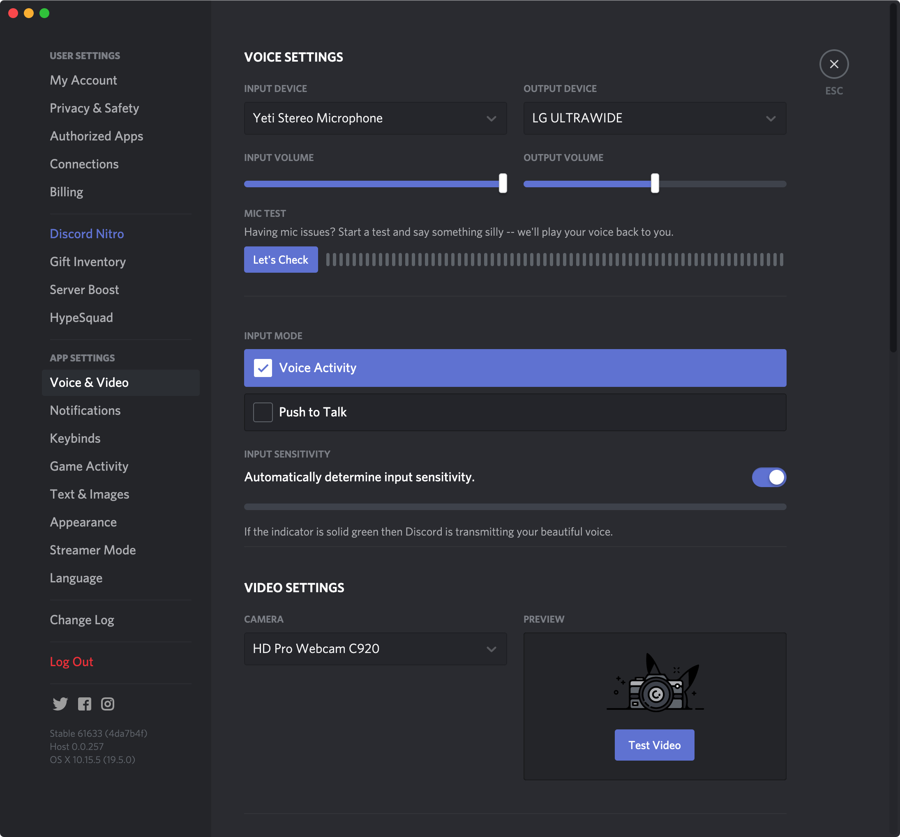

Go into the User Settings by clicking the cog icon near your profile image at
the bottom of the list of channels.

In the menu to the left select *Voice & Video*. You should see the screen presented in the image at the bottom of this document. We'll work through the most useful options to change from top to bottom.

## Devices

At the top are options to select your input device (the microphone you are going to use) and output device (the headphones or speaker you are using).

In general, you should use the best microphone you can and prefer headphones to speakers. It is common for people using speaker to find that the audio from them gets picked up by the microphone and creates an echo effect in the channel.

## Mic test

Discord has a feature to let you test your microphone without needing to talk to a real person. It is a good idea to make use of this.

## Input Mode

This lets you select between Voice Activity (where Discord will attempt to detect when you are speaking and start broadcasting your voice automatically) and Push to Talk (which works like a walkie-talkie and requires that you hold down a button while you are speaking).

Voice Activity is more convenient, but you may find that it picks up sounds you don't want to broadcast to the channel (such as echo from your speakers or the sound of you typing). Switching to Push to Talk can alleviate these problems.

## Video Settings

This lets you pick which web cam you are using and test that it is working. You should take this opportunity to ensure that any image you broadcast is suitable. Take the opportunity to check your clothes for spaghetti stains and your shelves for unsuitable ornaments.  

